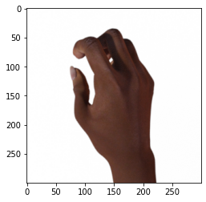
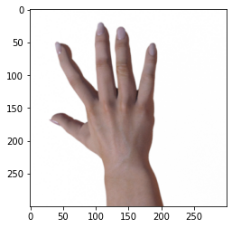
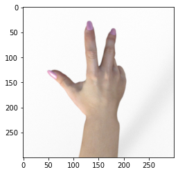
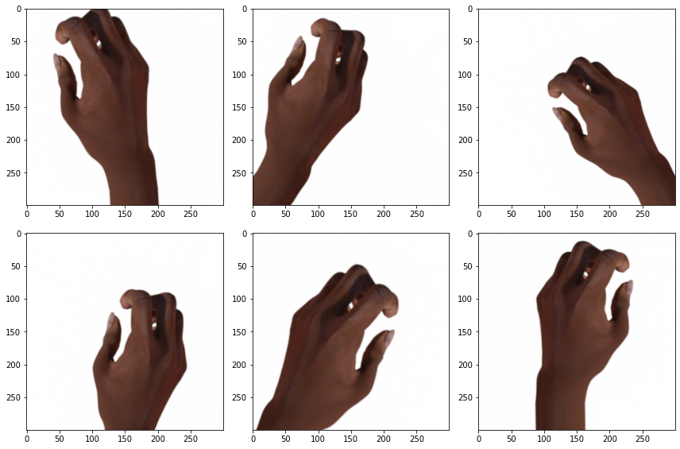

# Aplicação de CNNs em imagens de "Pedra, Papel e Tesoura"

## Introdução

Este projeto consiste em uma aplicação de Redes Neurais Convolucionais (CNNs) em imagens de mãos representando pedra, papel e tesoura. A aplicação divide-se em três partes principais:

* **Parte 1:** treinamento de uma CNN **sem** o processo de _data augmentation_ (aumento de dados) com o dataset [rock_paper_scissors](https://www.tensorflow.org/datasets/catalog/rock_paper_scissors), do catálogo de datasets do TensorFlow;
* **Parte 2:** treinamento de uma CNN **com** o processo de data augmentation usando o dataset rock_paper_scissors;
* **Parte 3:** testes com a melhor CNN treinada para classificar fotos de mãos fazendo os três gestos (pedra, papel e tesoura).

## Explorando o dataset

O dataset rock_paper_scissors possui, ao todo, 2892 imagens, sendo 964 de cada uma das três classes possíveis. Dentre essas, 2520 são de treinamento e 372 são de teste. Seguem alguns exemplos dessas imagens:

  

Neste projeto, essas imagens de teste serão usadas como dados de validação. Ou seja, em cada época da etapa de treinamento, o otimizador usado calculará a função de perda (comumente chamada de "loss") usando esses dados de validação e usará isso para atualizar os pesos das CNNs por meio do processo de _backpropagation_ (retropropagação).

Com isso, levando em conta que todos os dados serão usados na etapa de treinamento dos modelos, precisaremos de imagens novas para fazer os testes. Essas imagens serão fotos reais de mãos, que eu e meus familiares providenciamos, tais como as que seguem:

  

## Processo de data augmentation

O processo de data augmentation consiste em gerar novos dados a partir dos dados já existentes. Quando trabalhamos com imagens, esses dados novos serão novas imagens, obtidas através de tranformações nas imagens originais. São alguns exemplos dessas transformações:

* Rotação
* Mudança na largura
* Mudança na altura
* Cisalhamento
* Zoom

Existem várias outras possíveis transformações. O módulo ```ImageDataGenerator```, da biblioteca ```keras_preprocessing.image```, é uma ótima alternativa para fazer o aumento de dados em tempo real (durante o treinamento do modelo) e foi o escolhido para fazer isso neste projeto. A documentação encontra-se [aqui](https://www.tensorflow.org/api_docs/python/tf/keras/preprocessing/image/ImageDataGenerator), bem como a lista com todas as tranformações possíveis.

Para exemplificar, tomemos a seguinte imagem do dataset:


Aplicando o processo de data augmentation e configurando vários parâmetros de transformação, essas são algumas imagens obtidas:



Note que tínhamos, inicialmente, uma imagem e obtemos 6 novas imagens com o aumento de dados. Nas CNNs treinadas neste projeto, esse processo é feito _durante_ a etapa de treinamento. 

A vantagem de fazermos isso é que, usando o módulo ```ImageDataGenerator```, é muito simples fazer o aumento de dados durante a etapa de treinamento do modelo; por outro lado, a desvantagem é que isso deixa o treinamento mais lento, de forma que - em determinadas situações - torna-se mais viável realizar o aumento de dados _antes_ do treinamento, de forma separada.

## Processo de data augmentation

O processo de data augmentation (aumento de dados) consiste em usar os dados já existentes para gerar mais dados. Quando trabalhamos com imagens, isso é feito a partir de transformações nas imagens existentes, gerando novas imagens.


[comment]: <> ## Treinamento do modelo _sem_ data augmentation

[comment]: <> Markdown is a lightweight and easy-to-use syntax for styling your writing. It includes conventions for

[comment]: <> ```markdown
[comment]: <>Syntax highlighted code block

[comment]: <># Header 1
[comment]: <>## Header 2
[comment]: <>### Header 3

[comment]: <>- Bulleted
[comment]: <>- List
[comment]: <>
[comment]: <>1. Numbered
[comment]: <>2. List
[comment]: <>
[comment]: <>**Bold** and _Italic_ and `Code` text.
[comment]: <>
[comment]: <>[Link](url) and 
[comment]: <>```


[comment]: <>## 

[comment]: <>## Links úteis

[comment]: <>[GitHub Flavored Markdown](https://guides.github.com/features/mastering-markdown/)

[comment]: <>[repository settings](https://github.com/gustavor10silva/CNN-Pedra-Papel-Tesoura/settings/pages)

[comment]: <>[documentation](https://docs.github.com/categories/github-pages-basics/)

[comment]: <>[contact support](https://support.github.com/contact)
[comment]: <>''''
